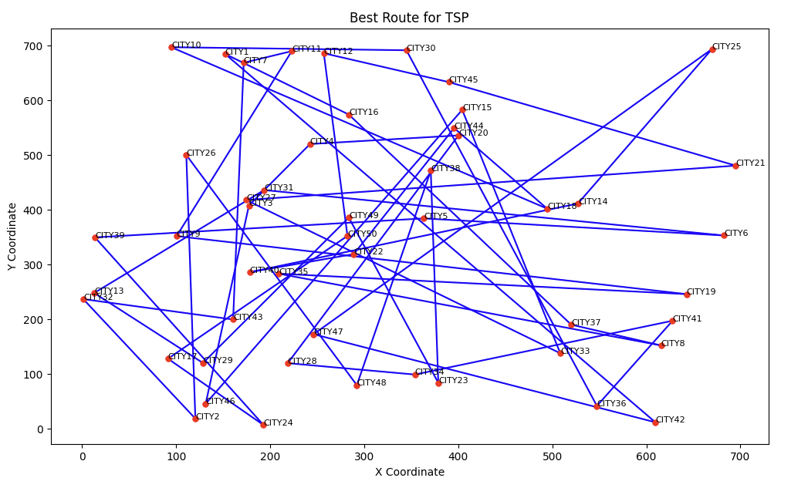
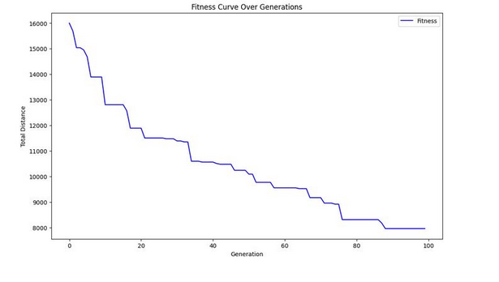

# Traveling Salesman Problem (TSP) Solution Visualization

## Overview
This repository contains visualizations related to the implementation of an algorithm that solves the Traveling Salesman Problem (TSP).

## Best Route for TSP

The first graph is a visualization of the best route found for the TSP. It plots the cities as points on a 2D plane, with the x-axis representing the X coordinate and the y-axis representing the Y coordinate. The cities are labeled `city1`, `city2`, ... , `cityN`. Lines connecting the cities represent the path of the traveling salesman. The goal of the TSP is to find the shortest possible route that visits each city exactly once and returns to the origin city.

## Fitness Curve Over Generations

The second graph is the Fitness Curve over Generations. It shows the evolution of the algorithm's fitness (which, in this context, is inversely proportional to the total distance of the route) over the course of generations. The x-axis represents the generation number, and the y-axis represents the total distance of the TSP route. As the generations progress, the fitness improves, indicating that the algorithm is finding shorter and more efficient routes.

## Algorithm

The underlying algorithm is likely a genetic algorithm or a similar evolutionary approach, which iteratively improves upon a population of solutions. Key to this process is the concept of 'fitness', which in the case of TSP is related to the total distance of the route.

## Usage

Details on how to run the visualization and the algorithm can be added here, along with any requirements or dependencies needed to replicate the results.

## Contributions

Information about how to contribute to this project can be added here, including coding standards, commit message guidelines, etc.

## License

Specify the license under which this project is released.

---

Feel free to clone this repository and explore the fascinating world of combinatorial optimization through the lens of the TSP!
